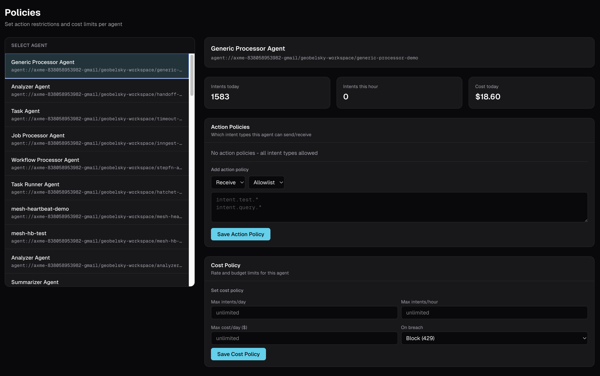

# AI Agent Cost Monitoring

Your AI agent spent $500 on OpenAI overnight and nobody noticed. AXME tracks cost per agent in real time with budget limits.

One runaway loop. One missing stop condition. One agent calling GPT-4 in a retry loop for 8 hours. Monday morning: a $500 invoice and no way to trace which agent, which task, or which prompt caused it.

> **Alpha** - Built with [AXME](https://github.com/AxmeAI/axme) (AXP Intent Protocol).
> [cloud.axme.ai](https://cloud.axme.ai) - [hello@axme.ai](mailto:hello@axme.ai)

---

## The Problem

AI agents call LLMs. LLMs cost money per token. Nobody tracks it.

```
Friday 5:00 PM:
  Deploy "research-agent" to production
  Agent processes customer tickets, calls GPT-4 for each one
  Expected: 200 tickets/day, ~$8/day

Friday 11:00 PM:
  Bug in ticket dedup - agent reprocesses same tickets in a loop
  Each iteration: 4 LLM calls x $0.03 = $0.12
  Loop runs 50x/hour

Saturday 3:00 AM:
  Agent has made 12,000 LLM calls
  Cost so far: $360
  Nobody is watching

Monday 9:00 AM:
  OpenAI billing alert (you set it at $500)
  Total damage: $487
  No logs showing which agent, which intent, which loop
```

What breaks:
- **No per-agent cost tracking** - OpenAI shows total org spend, not per-agent
- **No real-time visibility** - you find out days later from the invoice
- **No budget limits** - nothing stops an agent from spending indefinitely
- **No cost-per-intent** - you know the total but not which task caused it
- **No alerts** - the $500 billing alert is too late, too coarse

This is not hypothetical. Every team running agents in production has a cost horror story.

---

## The Solution: Cost Tracking via AXME Mesh

AXME agents report cost as part of their regular heartbeat. The gateway aggregates it per agent, per intent, per time window. Cost policies enforce hard limits.

```
Agent heartbeat (every 30s):
  {
    "agent": "agent://myorg/production/research-agent",
    "intent_id": "int_abc123",
    "status": "processing",
    "metrics": {
      "cost_usd": 0.03,        <-- cost since last heartbeat
      "llm_calls": 4,
      "tokens_in": 2100,
      "tokens_out": 850
    }
  }

Gateway receives heartbeat:
  1. Accumulate cost for this agent     -> $12.47 today
  2. Accumulate cost for this intent    -> $0.87 for this task
  3. Check against cost policy          -> limit: $50/day
  4. Under limit? Continue.
  5. Over limit? Pause agent, notify owner.
```

No separate billing integration. No scraping OpenAI dashboards. Cost data flows through the same channel as agent status.

---

## Quick Start

```bash
pip install axme
export AXME_API_KEY="your-key"   # Get one: axme login
```

### Report cost from your agent

```python
from axme import AxmeClient, AxmeClientConfig
import os

client = AxmeClient(AxmeClientConfig(api_key=os.environ["AXME_API_KEY"]))

# After each LLM call, report the cost
def call_llm(prompt: str) -> str:
    response = openai.chat.completions.create(
        model="gpt-4",
        messages=[{"role": "user", "content": prompt}],
    )

    # Extract cost from usage
    tokens_in = response.usage.prompt_tokens
    tokens_out = response.usage.completion_tokens
    cost_usd = (tokens_in * 0.03 + tokens_out * 0.06) / 1000

    # Report to AXME mesh
    client.mesh.report_metric(
        agent="agent://myorg/production/research-agent",
        intent_id=current_intent_id,
        cost_usd=cost_usd,
        metadata={
            "model": "gpt-4",
            "tokens_in": tokens_in,
            "tokens_out": tokens_out,
        },
    )

    return response.choices[0].message.content
```

### Set a cost policy

```python
# Set budget limit: $50/day for this agent
client.mesh.set_cost_policy(
    agent="agent://myorg/production/research-agent",
    rules=[
        {
            "period": "day",
            "limit_usd": 50.00,
            "action": "pause",           # pause | alert | kill
            "notify": ["ops@company.com"],
        },
        {
            "period": "intent",
            "limit_usd": 5.00,
            "action": "alert",           # single task shouldn't cost >$5
            "notify": ["ops@company.com"],
        },
    ],
)
```

### Or via CLI

```bash
# Set daily budget
axme mesh cost-policy set \
  --agent agent://myorg/production/research-agent \
  --period day \
  --limit 50.00 \
  --action pause

# Check current spend
axme mesh cost show --agent agent://myorg/production/research-agent
# Agent: research-agent
# Today:     $12.47 / $50.00 (24.9%)
# This week: $47.82
# This month: $189.30

# List top spenders
axme mesh cost top --period day
# 1. research-agent      $12.47
# 2. support-agent       $8.23
# 3. onboarding-agent    $3.10
```

---

## Dashboard


View cost data at [mesh.axme.ai](https://mesh.axme.ai) with per-agent breakdown:

```
+---------------------+----------+----------+-----------+--------+
| Agent               | Today    | This Wk  | This Mo   | Status |
+---------------------+----------+----------+-----------+--------+
| research-agent      | $12.47   | $47.82   | $189.30   | OK     |
| support-agent       | $8.23    | $31.05   | $142.18   | OK     |
| onboarding-agent    | $3.10    | $14.22   | $58.91    | OK     |
| data-pipeline       | $0.00    | $22.40   | $89.60    | PAUSED |
+---------------------+----------+----------+-----------+--------+
| Total               | $23.80   | $115.49  | $479.99   |        |
+---------------------+----------+----------+-----------+--------+

Cost Policy Violations (last 7 days):
  Mar 28  data-pipeline     $52.10 / $50.00 day limit  -> PAUSED
  Mar 25  research-agent    $4.87 / $5.00 intent limit -> ALERTED
```



Drill into any agent to see cost per intent, per model, per hour.

---

## How It Works

```
+-----------+   heartbeat    +----------------+   dashboard   +-----------+
|           |  (cost_usd)    |                |  (aggregate)  |           |
|   Agent   | -------------> |   AXME Cloud   | ------------> |   mesh    |
|           |                |   (gateway)    |               |  .axme.ai |
|           |   pause/kill   |                |   alerts      |           |
|           | <------------- |  cost policy   | ------------> |   email   |
|           |  if over limit |  enforcement   |  if threshold |   slack   |
+-----------+                +----------------+               +-----------+
```

1. Agent makes LLM calls and tracks token usage locally
2. Every heartbeat (30s), agent reports `cost_usd` to AXME gateway
3. Gateway **accumulates** cost per agent, per intent, per time window
4. Gateway **checks cost policies** on every heartbeat
5. If a policy limit is exceeded:
   - `alert` - send notification, agent continues
   - `pause` - send notification, pause intent delivery to agent
   - `kill` - send notification, terminate active intents
6. Dashboard shows real-time cost per agent with drill-down

Cost data is stored alongside intent lifecycle data - same PostgreSQL, same retention, same audit trail. No separate billing database.

---

## Before / After

### Before: No Cost Visibility

```python
# Your agent code - no cost tracking
def process_ticket(ticket):
    response = openai.chat.completions.create(
        model="gpt-4",
        messages=[{"role": "user", "content": ticket["body"]}],
    )
    return response.choices[0].message.content

# How much did this cost? Check OpenAI dashboard... in 24 hours.
# Which agent? Which task? No idea.
# Budget limit? Set a billing alert at $500 and hope for the best.
```

### After: Per-Agent Cost Tracking with Limits

```python
# Same agent code + AXME cost reporting
def process_ticket(ticket):
    response = openai.chat.completions.create(
        model="gpt-4",
        messages=[{"role": "user", "content": ticket["body"]}],
    )

    # 2 lines: calculate and report
    cost = (response.usage.prompt_tokens * 0.03 + response.usage.completion_tokens * 0.06) / 1000
    client.mesh.report_metric(cost_usd=cost, intent_id=intent_id)

    return response.choices[0].message.content

# Cost visible in real time. Per agent. Per intent.
# Budget exceeded? Agent pauses automatically.
```

---

## Multi-Model Cost Tracking

Agents often use multiple models. AXME tracks cost per model:

```python
MODEL_COSTS = {
    "gpt-4":       {"input": 0.03,  "output": 0.06},
    "gpt-4o":      {"input": 0.005, "output": 0.015},
    "gpt-4o-mini": {"input": 0.00015, "output": 0.0006},
    "claude-sonnet-4-20250514":  {"input": 0.003, "output": 0.015},
}

def call_llm(model: str, prompt: str) -> str:
    response = openai.chat.completions.create(
        model=model,
        messages=[{"role": "user", "content": prompt}],
    )

    rates = MODEL_COSTS[model]
    cost = (
        response.usage.prompt_tokens * rates["input"]
        + response.usage.completion_tokens * rates["output"]
    ) / 1000

    client.mesh.report_metric(
        cost_usd=cost,
        intent_id=current_intent_id,
        metadata={"model": model},
    )

    return response.choices[0].message.content
```

Dashboard breaks down cost by model:

```
research-agent cost breakdown (today):
  gpt-4:          $9.20  (73.8%)
  gpt-4o:         $2.85  (22.8%)
  gpt-4o-mini:    $0.42  (3.4%)
  Total:          $12.47
```

---

## Related

- [AXME](https://github.com/AxmeAI/axme) - project overview
- [AXP Spec](https://github.com/AxmeAI/axp-spec) - open Intent Protocol specification
- [AXME Examples](https://github.com/AxmeAI/axme-examples) - 20+ runnable examples across 5 languages
- [AXME CLI](https://github.com/AxmeAI/axme-cli) - manage intents, agents, scenarios from the terminal
- [AI Agent Checkpoint and Resume](https://github.com/AxmeAI/ai-agent-checkpoint-and-resume) - durable agent execution
- [Async Human Approval for AI Agents](https://github.com/AxmeAI/async-human-approval-for-ai-agents) - async approval with reminders

---

## License

MIT - see [LICENSE](LICENSE)

---

Built with [AXME](https://github.com/AxmeAI/axme) (AXP Intent Protocol).
